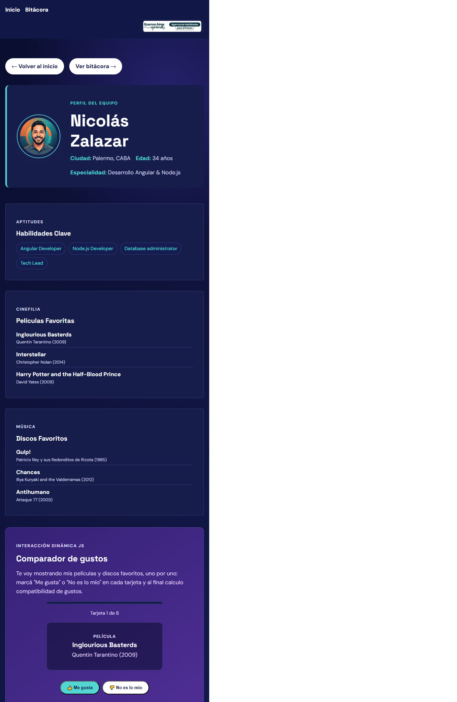
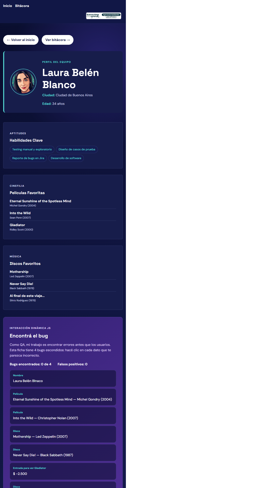
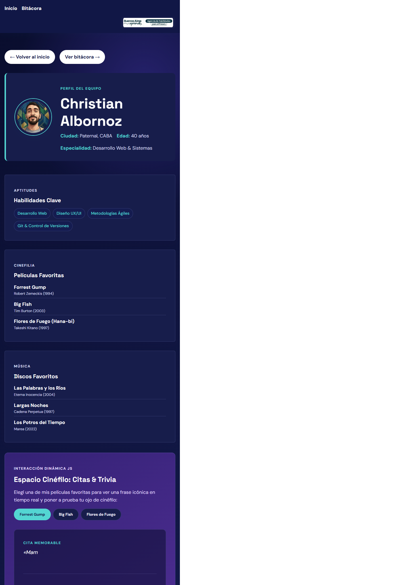
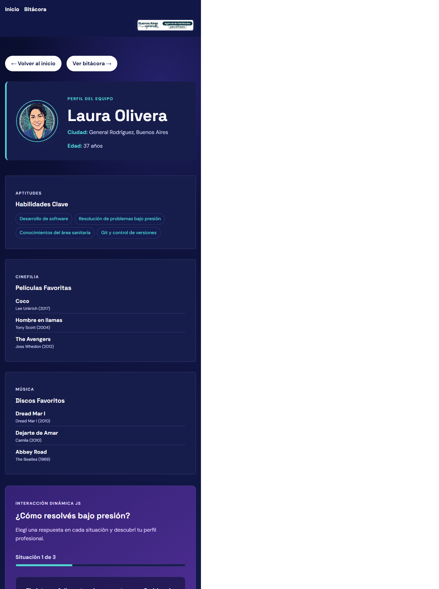
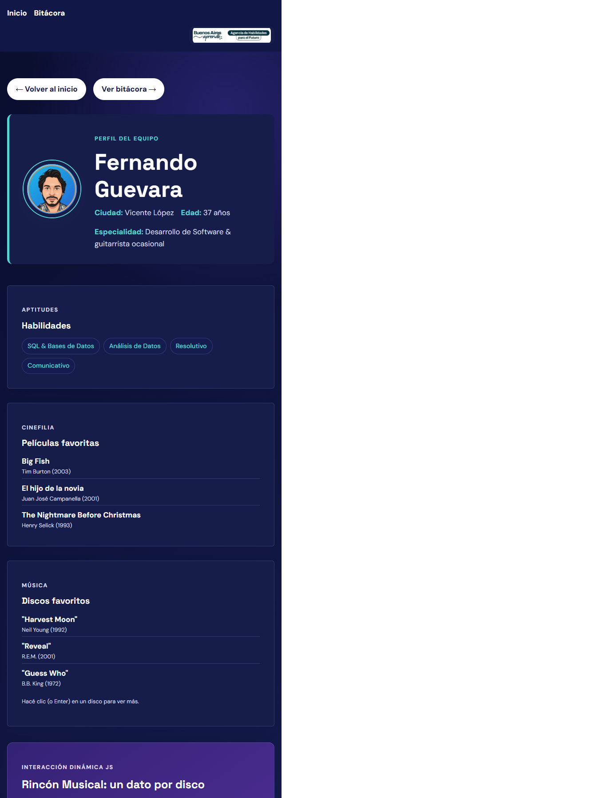

# Grupo 15 — Sitio Web Grupal

> **TP1 · Desarrollo de Sistemas Web · Front End · 2026 2C**
> Sitio web grupal con portada, perfiles individuales, navegación interna y bitácora de desarrollo.

🔗 **Sitio publicado:** _pendiente de deploy en Vercel (Sprint 5)_
📋 **Tablero de tareas:** [GitHub Project](https://github.com/Nicoalazar/SitioWebGrupal/projects) · [Issues](https://github.com/Nicoalazar/SitioWebGrupal/issues)
🗺️ **Plan de trabajo:** [docs/release-plan.md](docs/release-plan.md)

---

## Índice

1. [Descripción del proyecto](#1-descripción-del-proyecto)
2. [Integrantes](#2-integrantes)
3. [Roles del equipo](#3-roles-del-equipo)
4. [Tecnologías utilizadas](#4-tecnologías-utilizadas)
5. [Convenciones de trabajo](#5-convenciones-de-trabajo)
6. [Estructura de archivos y carpetas](#6-estructura-de-archivos-y-carpetas)
7. [Guía de estilos](#7-guía-de-estilos)
8. [Funciones JavaScript](#8-funciones-javascript)
9. [Bitácora de desarrollo](#9-bitácora-de-desarrollo)
10. [Publicación en Vercel](#10-publicación-en-vercel)
11. [Uso de IA y criterio de privacidad](#11-uso-de-ia-y-criterio-de-privacidad)
12. [Evolución del proyecto](#12-evolución-del-proyecto)

---

## 1. Descripción del proyecto

Somos un equipo de cinco estudiantes que aprende haciendo. Este sitio presenta nuestras habilidades e intereses y registra las decisiones tomadas durante el desarrollo del TP1.

El sitio se compone de:

- **Portada (`index.html`)**: nombre y propósito del equipo, listado de integrantes con enlaces a sus perfiles.
- **Perfiles individuales**: una página por integrante con foto/avatar, nombre, ciudad, edad, cuatro habilidades, tres películas y tres discos favoritos, más una interacción JavaScript propia.
- **Bitácora (`bitacora.html`)**: registro fechado de decisiones, dificultades y cambios durante el desarrollo.

---

## 2. Integrantes

<!-- Cada integrante agrega su propia fila en un commit propio (Sprint 0) -->

| Nombre | GitHub | Página individual |
|---|---|---|
| Nicolás Zalazar | [@Nicoalazar](https://github.com/Nicoalazar) | `nicolas-zalazar.html` _(Sprint 2)_ |
| Laura Belén Blanco | [@LauBelen](https://github.com/LauBelen) | `laura-blanco.html` _(Sprint 2)_ |
| Christian Albornoz | [@albor77](https://github.com/albor77) | `christian-albornoz.html` _(Sprint 2)_ |
| Laura Olivera | [@laura108814](https://github.com/laura108814) | `laura-olivera.html` _(Sprint 2)_ |
| Fernando Guevara | [@Fer-505](https://github.com/Fer-505) | `fernando-guevara.html` _(Sprint 2)_ |

---

## 3. Roles del equipo

<!-- Sprint 0: completar cuando el equipo acuerde la distribución -->

| Rol | Responsable | Alcance |
|---|---|---|
| Portada (`index.html`) | [a definir] | Estructura, contenido y función JS de la portada |
| Paleta y tipografía | Laura Olivera | Definir colores, Google Fonts e iconografía; mantener `css/base.css` |
| Template de perfil | [a definir] | Diseñar la estructura base que reutilizan todos los perfiles |
| Bitácora y documentación | [a definir] | Mantener `bitacora.html` y el README actualizados por sprint |
| Página individual | Cada integrante | Cada persona es dueña de su propio perfil y su función JS |

**Canal de comunicación del equipo:** grupo de WhatsApp
**Frecuencia de sincronización:** [a definir — ej. una reunión breve por sprint]

---

## 4. Tecnologías utilizadas

| Tecnología | Uso |
|---|---|
| **HTML5** | Estructura semántica de todas las páginas |
| **CSS3** | Estilos propios, variables CSS, diseño responsive con media queries |
| **JavaScript (vanilla)** | Interacciones dinámicas en portada y perfiles, sin frameworks ni librerías |
| **Google Fonts** | Tipografía del sitio _(ver [Guía de estilos](#7-guía-de-estilos))_ |
| **Git + GitHub** | Control de versiones, Issues y GitHub Projects para gestión de tareas |
| **Vercel** | Publicación del sitio estático |

---

## 5. Convenciones de trabajo

### Ramas

- `main`: rama estable. Solo recibe cambios vía Pull Request.
- `development`: rama de integración de los sprints.
- `feature/<nombre-tarea>` o `<n>-<slug-del-issue>`: una rama por tarea/issue. Ejemplo: `1-sprint-0-gobernanza-del-proyecto`.

Flujo: `feature/*` → PR hacia `development` → al cerrar un sprint, PR de `development` hacia `main`.

### Commits — Conventional Commits

Todos los commits siguen el formato `<tipo>: <descripción en minúsculas, en imperativo>`:

| Tipo | Cuándo usarlo | Ejemplo |
|---|---|---|
| `feat:` | Nueva funcionalidad o página | `feat: agregar filtro de integrantes en portada` |
| `fix:` | Corrección de un error | `fix: corregir enlace roto al perfil de Ana` |
| `style:` | Cambios de CSS / formato sin afectar lógica | `style: ajustar espaciado de tarjetas en 400px` |
| `docs:` | README, bitácora, comentarios | `docs: documentar función JS de la portada` |
| `refactor:` | Reorganizar código sin cambiar comportamiento | `refactor: mover variables de color a base.css` |
| `chore:` | Tareas de mantenimiento, configuración | `chore: agregar .gitignore` |

### Pull Requests

- Cada PR referencia su issue (`Closes #N`).
- Se usa la plantilla de `.github/PULL_REQUEST_TEMPLATE.md`.
- Al menos otra persona del equipo revisa antes del merge.

### Ritmo de trabajo

- Trabajo organizado en sprints (ver [docs/release-plan.md](docs/release-plan.md)).
- Cada integrante hace **al menos un commit propio por sprint**.
- Al cerrar cada sprint se actualizan `bitacora.html` y este README.

---

## 6. Estructura de archivos y carpetas

<!-- Actualizar a medida que se agregan páginas y archivos -->

```
SitioWebGrupal/
├── index.html                 # Portada (Sprint 1)
├── bitacora.html              # Bitácora de desarrollo
├── nicolas-zalazar.html       # Perfiles individuales, uno por integrante (Sprint 2)
├── laura-blanco.html
├── christian-albornoz.html
├── laura-olivera.html
├── fernando-guevara.html
├── css/
│   ├── base.css               # Variables CSS, reset y estilos globales (Sprint 1)
│   └── nav.css                # Estilos reutilizables de navegación (Sprint 1)
├── js/
│   └── portada.js             # Interacción de la portada (Sprint 1)
├── img/
│   ├── perfiles/              # Fotos o avatares de los integrantes (Sprint 2)
│   └── capturas/              # Evidencias de las funciones JavaScript
├── docs/
│   └── release-plan.md        # Plan de sprints del equipo
├── .github/
│   └── PULL_REQUEST_TEMPLATE.md
├── .gitignore
└── README.md
```

---

## 7. Guía de estilos

### Paleta de colores

| Variable CSS | Hex | Uso |
|---|---|---|
| `--color-primary` | `#111746` | Header y bloques destacados |
| `--color-secondary` | `#342275` | Enlaces y etiquetas |
| `--color-accent` | `#53d6d2` | Acentos y estados activos |
| `--color-bg` | `#090d2d` | Fondo general |
| `--color-text` | `#f6f5ff` | Texto principal |

### Tipografía (Google Fonts)

| Uso | Fuente | Pesos |
|---|---|---|
| Títulos | Space Grotesk | 500, 600, 700 |
| Cuerpo | DM Sans | 400, 500, 700 |

### Iconografía

No se utiliza una librería de íconos en Sprint 1. Los enlaces se presentan como texto para priorizar claridad y accesibilidad.

### Breakpoints

| Nombre | Ancho | Dispositivo de referencia |
|---|---|---|
| Mobile | `400px` | Celular |
| Tablet | `900px` | Tablet / celular apaisado |
| Desktop | `1200px` | Escritorio |

### Cómo crear un perfil

Todos los perfiles deben reutilizar `css/base.css` y `css/nav.css`. Para mantener la identidad visual, no se deben inventar colores directamente en cada HTML.

Estructura mínima recomendada:

```html
<main class="site-main">
	<div class="container">
		<section class="profile-intro">
			
			<p class="eyebrow">Perfil del equipo</p>
			<h1>Nombre Apellido</h1>
			<p>Descripción breve del integrante.</p>
		</section>
	</div>
</main>
```

Las fotos se guardan en `img/perfiles/`. Para cambiar la apariencia se usan clases existentes y variables de `:root`, por ejemplo `service-card--featured`, `hero-button` y `profile-photo`. Si se necesita una nueva variante, se agrega primero a `css/base.css` para que pueda reutilizarla todo el equipo.

### Accesibilidad y responsive

- Las páginas usan HTML semántico, `lang="es"` y navegación compartida.
- El enlace "Saltar al contenido principal" permite navegar con teclado.
- Los controles interactivos tienen foco visible y nombres comprensibles.
- El buscador tiene etiqueta accesible y el carrusel comunica su posición con `aria-live`.
- Se respeta `prefers-reduced-motion` para reducir las transiciones.
- La portada se probó en 400px, 768px y 1200px sin overflow horizontal.
- Las fotos de perfiles deben tener texto alternativo y los controles deben poder usarse con teclado y tacto.

---

## 8. Funciones JavaScript

<!-- Sprint 1 y 2: una subsección por función, con captura en img/capturas/ -->

### Portada

**Función:** búsqueda y filtrado de integrantes
**Archivo:** `js/portada.js`
**Qué hace:** filtra las tarjetas por nombre a medida que se escribe y muestra un mensaje cuando no hay coincidencias.
**Por qué la elegimos:** permite encontrar rápidamente un perfil y aporta una interacción útil para una portada con varios integrantes.


### Perfil — Nicolás Zalazar

**Función:** Comparador de gustos
**Archivo:** `js/perfil-nicolas.js`
**Qué hace:** muestra mis películas y discos favoritos de a una tarjeta por vez; el visitante responde "Me gusta" o "No es lo mío" en cada una y, al terminar el mazo, la página calcula el porcentaje de coincidencia con una barra de progreso y un mensaje que cambia según el nivel de compatibilidad. Incluye un botón para reiniciar el recorrido.



### Perfil — Laura Belén Blanco

**Función:** [nombre]
**Archivo:** `js/[archivo].js`
**Qué hace:** [descripción]



### Perfil — Christian Albornoz

**Función:** [nombre]
**Archivo:** `js/[archivo].js`
**Qué hace:** [descripción]



### Perfil — Laura Olivera

**Función:** test de resolución bajo presión
**Archivo:** `js/perfil-laura-olivera.js`
**Qué hace:** presenta tres situaciones con opciones, calcula un puntaje según las respuestas y muestra un perfil profesional personalizado al finalizar. También permite reiniciar el test.



### Perfil — Fernando Guevara

**Función:** [nombre]
**Archivo:** `js/[archivo].js`
**Qué hace:** [descripción]



---

## 9. Bitácora de desarrollo

La bitácora completa está en [`bitacora.html`](bitacora.html), accesible desde el menú principal del sitio.
Registra, por sprint, las decisiones tomadas, los problemas encontrados y cómo se resolvieron.

---

## 10. Publicación en Vercel

<!-- Sprint 5 -->

**URL:** [pendiente]

Pasos de deploy: [a documentar]

---

## 11. Uso de IA y criterio de privacidad

<!-- Sprint 4: completar con ejemplos concretos, no genéricos -->

### Herramientas y modelos utilizados

| Herramienta | Modelo | Plan | Experiencia previa del equipo |
|---|---|---|---|
| Claude Code | Claude Opus 5 | [gratuito / pago] | [a completar] |
| [otra] | [modelo] | [plan] | [a completar] |

### En qué asistió

- **Planificación:** generación del plan de sprints (`docs/release-plan.md`) y del esqueleto de README a partir de la consigna. Revisado y ajustado por el equipo.
- **Código:** [a completar — qué funciones, qué estilos]
- **Debugging:** [a completar]
- **Contenido:** [a completar]

### Imágenes y avatares generados con IA

[a completar — modelo utilizado y criterio de los prompts, o "no se usaron"]

### Qué revisamos, adaptamos o cambiamos con criterio propio

[a completar con ejemplos concretos — esto es lo que sostiene la autoría del equipo]

### Criterio de privacidad

[a completar — ej. uso de avatares en lugar de fotos personales, qué datos personales se decidió no publicar]

---

## 12. Evolución del proyecto

<!-- Sprint 4/5: qué se planea ampliar en los próximos TPs -->

- [a completar]
